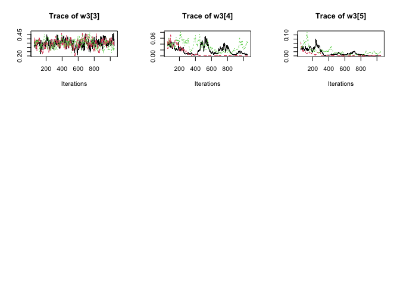
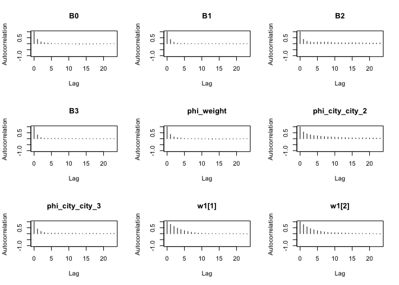

<!-- README.md is generated from README.Rmd. Please edit that file -->

# fgwqsr – Frequentist Grouped Weighted Quantile Sum Regression

Fully frequentist model fitting procedure for the weighted quantile sum
regression formulation. Included in this package is an implementation of
Bayesian Grouped Weighted Quantile Sum Regression (bgwqsr) introduced by
Wheeler, David C et al. that fits Markov Chain Monte Carlo (MCMC) chains
in parallel through the runjags package.

<!-- badges: start -->
<!-- badges: end -->

# Overview

<br> FGWQSR estimates parameters to the following model:

<br>

$$y_i \sim \text{Bernoulli}(\pi_i) $$
$$\text{logit}(\pi_i) = c_0+ \sum\limits_{g = 1}^G \gamma_g \bigg( \sum\limits_{k = 1} ^{c_g} w_{g,k} \cdot q_{g,k,i}\bigg) + \sum_{r = 1}^R \phi_rz_{r,i} $$
where

- $y_i$ - outcome variable (coded 0 1)

- $c_0$ - offset variable (intercept)

- $G$ - total number of chemical mixture groups

- $\gamma_g$ - group index effect corresponding to mixture group $g$

- $c_g$ - total number of chemicals in group $g$

- $w_{g,k}$ - weight for chemical $k$ in group $g$

- $q_{g,k,i}$ - quantized chemical exposure $k$ in group $g$ for
  individual $i$

- $R$ - total number of adjusting covariates

- $\phi_r$ - effect of $r^{\text{th}}$ adjusting covariate

- $z_{r,i}$ - measure of adjusting covariate $r$ for individual $i$

subject to the constraints
$$\sum_{k = 1}^{c_g} w_{g,k} =1, \ w_{g,k} \in (0,1)$$ without requiring
.

<br>

# Installation

You can install the development version of fgwqsr from
[GitHub](https://github.com/) with:

``` r
# install.packages("devtools")
devtools::install_github("Daniel-Rud/fgwqsr")
```

``` r
library(fgwqsr)
```

In order to use fgwqsr, let us first generate some data

# Data Generation

<br> To begin, let us generate some data to use. We will have 14
underlying chemical exposure variables, with mixture groups of sizes
(5,4,5) and weight distribution

- $\mathbf{w}_1 = (1/3,1/3,1/3,0,0)$

- $\mathbf{w}_2 = (1/2,1/2, 0, 0)$

- $\mathbf{w}_3 = (1/3,1/3,1/3,0,0)$.

We will use a fixed correlation structure such that the correlation of
chemicals within a group is .7 and the cross correlations between 2
chemicals in different groups is .5. <br> We first define ESS and CCS.
ESS is a list that contains the the sample size and the true underlying
weight distribution of the chemicals in each group. CCS is a two element
vector where the first index defines the within group correlation and
the second index controls the between group correlation. The sample size
for our dataset is fixed to $n = 10,000$ and we set the distribution of
the true underlying weights as follows:

<br> We set the group index effects for the three groups as follows (in
OR scale): $\exp(\gamma_1) = .5$, $\exp(\gamma_2) = 1$,
$\exp(\gamma_3) = 1.5$

``` r
n = 10000

gamma = log(c(.5,1,1.5)) # group index sizes in log odds scale

ess = list(n = n, 
           weights = list(w1 = c(1/3,1/3,1/3,0,0), 
                          w2 = c(1/2,1/2, 0, 0), 
                          w3 = c(1/3,1/3,1/3,0,0)
                          )
           )

ccs = c(.5,.1)
```

<br>

We create a function to create the desired correlation matrix.

``` r
# function to create correlation matrix 
create_corr_mat = function(ESS, CCS)
{
  num_pollutants = length(unlist(ESS$weights))
  num_groups = length(ESS$weights)
  
  current_index = 1
  
  corr_mat = diag(num_pollutants)
  
  # populate within group correlation blocks 
  for(i in 1:num_groups) # for each of the pollutant groups
  {
    corr_mat[current_index:(current_index + length(ESS$weights[[i]])-1), 
             current_index:(current_index + length(ESS$weights[[i]])-1) ] = CCS[1]
    current_index = current_index + length(ESS$weights[[i]])
  }
  
  # populate between group pollutant correlations 
  # set diagonal to 1 
  for(i in 1:num_pollutants)
  {
    corr_mat[i, which(corr_mat[i,] == 0)] = CCS[2]
    corr_mat[i,i] = 1
  }
  
  return(corr_mat)
}
```

<br>

Now we create a correlation matrix

``` r
corr = create_corr_mat(ESS = ess, CCS = ccs)

corr %>% data.frame # for viewing  
#>     X1  X2  X3  X4  X5  X6  X7  X8  X9 X10 X11 X12 X13 X14
#> 1  1.0 0.5 0.5 0.5 0.5 0.1 0.1 0.1 0.1 0.1 0.1 0.1 0.1 0.1
#> 2  0.5 1.0 0.5 0.5 0.5 0.1 0.1 0.1 0.1 0.1 0.1 0.1 0.1 0.1
#> 3  0.5 0.5 1.0 0.5 0.5 0.1 0.1 0.1 0.1 0.1 0.1 0.1 0.1 0.1
#> 4  0.5 0.5 0.5 1.0 0.5 0.1 0.1 0.1 0.1 0.1 0.1 0.1 0.1 0.1
#> 5  0.5 0.5 0.5 0.5 1.0 0.1 0.1 0.1 0.1 0.1 0.1 0.1 0.1 0.1
#> 6  0.1 0.1 0.1 0.1 0.1 1.0 0.5 0.5 0.5 0.1 0.1 0.1 0.1 0.1
#> 7  0.1 0.1 0.1 0.1 0.1 0.5 1.0 0.5 0.5 0.1 0.1 0.1 0.1 0.1
#> 8  0.1 0.1 0.1 0.1 0.1 0.5 0.5 1.0 0.5 0.1 0.1 0.1 0.1 0.1
#> 9  0.1 0.1 0.1 0.1 0.1 0.5 0.5 0.5 1.0 0.1 0.1 0.1 0.1 0.1
#> 10 0.1 0.1 0.1 0.1 0.1 0.1 0.1 0.1 0.1 1.0 0.5 0.5 0.5 0.5
#> 11 0.1 0.1 0.1 0.1 0.1 0.1 0.1 0.1 0.1 0.5 1.0 0.5 0.5 0.5
#> 12 0.1 0.1 0.1 0.1 0.1 0.1 0.1 0.1 0.1 0.5 0.5 1.0 0.5 0.5
#> 13 0.1 0.1 0.1 0.1 0.1 0.1 0.1 0.1 0.1 0.5 0.5 0.5 1.0 0.5
#> 14 0.1 0.1 0.1 0.1 0.1 0.1 0.1 0.1 0.1 0.5 0.5 0.5 0.5 1.0
```

<br>

We generate our exposure data based on the derived correlation
structure. We will use 5 quantiles, as that is the default for FGWQSR.

``` r
set.seed(11) # for reproducibility
chem_data = mvtnorm::rmvnorm(n, mean = rep(0, 14), sigma = corr)
```

<br>

Next, we quantize the exposure variables in order to make comparisons
between the true underlying oracle model and FGWQSR estimates. Note that
we will subtract 1 from our quantized variables, so that the first
quintile corresponds to the measure of 0. By doing this, we can ensure
that we have an interpretable model intercept.

``` r
chem_data = apply(chem_data, MARGIN = 2, statar::xtile, n = 5) - 1

head(chem_data %>% data.frame)
#>   X1 X2 X3 X4 X5 X6 X7 X8 X9 X10 X11 X12 X13 X14
#> 1  0  1  0  0  3  1  4  3  2   0   0   0   0   0
#> 2  0  1  1  3  1  0  0  1  1   2   2   2   1   1
#> 3  1  0  0  0  2  0  0  2  1   3   1   1   0   1
#> 4  3  0  3  1  0  4  4  3  4   2   1   3   2   3
#> 5  2  3  4  3  1  4  2  0  3   4   1   1   1   3
#> 6  3  2  1  3  4  2  1  2  0   2   2   2   1   0
```

<br>

Finally, we create the logistic outcome variable

``` r

intercept = 0

# create logit(pi) outcome 
logit_pi =  gamma[1] * (chem_data[, 1:5] %*% ess$weights$w1) + 
  gamma[2] * (chem_data[, 6:9] %*% ess$weights$w2) + 
  gamma[3] * (chem_data[, 10:14] %*% ess$weights$w3) + intercept

# transform to pi 
pi = stats::plogis(logit_pi)

# transform to bernoulli outcome 
y = sapply(pi, FUN = function(p) rbinom(1,1,p))

# create dataset 
data = data.frame(y = y, chem_data)

# view dataset
head(data)
#>   y X1 X2 X3 X4 X5 X6 X7 X8 X9 X10 X11 X12 X13 X14
#> 1 0  0  1  0  0  3  1  4  3  2   0   0   0   0   0
#> 2 1  0  1  1  3  1  0  0  1  1   2   2   2   1   1
#> 3 0  1  0  0  0  2  0  0  2  1   3   1   1   0   1
#> 4 0  3  0  3  1  0  4  4  3  4   2   1   3   2   3
#> 5 0  2  3  4  3  1  4  2  0  3   4   1   1   1   3
#> 6 1  3  2  1  3  4  2  1  2  0   2   2   2   1   0
```

<br> Now, we are ready to fit a FGWQSR model

<br>

# Fitting using FGWQSR

<br> From the FGWQSR package, the main function we will be using to fit
models if the `fgwqsr()` function. The model formula that we specify
will be different than traditional formulas in lm and glm, as we will
need to denote our mixture groups. Three special characters are used in
fgwqsr formulas: <br>

- `|` - denotes the boundary of a mixture group, used to seperate
  chemicals within a mixture group.

- `/` - denotes the end of the mixture group specification, adjusting
  covariates can be added to the formula after this character. If no
  adjusting covariates, do not need to specify.

- `i.` - precedes categorical variables to denote a categorical
  variable. For example, if we have a categorical variable cat_var, we
  would denote this in the model formula by i.cat_var. This is similar
  to the stata syntax to declare categorical variables.

<br> The `fgwqsr()` function has other options too: <br>

- `data` - a data frame object containing variable columnames referenced
  in model formula (cat vars do not need to be named with i. in column
  names).

- `quantiles` - number of quantiles to quantize the exposure variables
  in the mixture portion of the model.

- `n_mvn_sims` - defines resolution for simulated null distribution for
  group index and single chemical LRTs. Default is 10,000.

- `zero_threshold_cutoff` - Value within (0,.5\] that defines how often
  parameters estimated close to the boundary of the parameter space are
  assigned a boundary cone in the constrained multivariate normal monte
  carlo inference procedure. A value of 0.5 will assign parameters with
  FGWQSR maximum likelihood estimates of precisely 0 the boundary cone
  while a value of 0 will assign all parameters a boundary cone.
  Reasonable values may be within \[0.05, 0.5\] – all choices of are
  asymptotically equivalent. The default is set to
  zero_tolerance_threshold = 0.5.

- `verbose` - Displays messages and progress bar while fitting FGWQSR
  model. Default is TRUE.

- `cores` - number of cores to parallelize on for fitting nested models
  and simulated null LRT distributions. Default is number of available
  cores on user device.

- `optim_control_list` - option to supply control options to optim.

<br>

First, we will focus on fitting models with only chemical mixture
variables. To do this, we will supply the model formula as follows:

``` r

mod_formula = y ~ X1 + X2 + X3 + X4 + X5 | X6 + X7 + X8 + X9 | X10 + X11 + X12 + X13 + X14
```

<br>

Notice that we did not use the `/` character since we did not include
adjusting covariates. Now, we can fit the model using the function
`fgwqsr()`.

``` r
fgwqsr_fit = fgwqsr(formula = mod_formula,
                    data = data,
                    quantiles = 5,
                    n_mvn_sims = 10000,
                    verbose = T)
#> 
#> Fitting full model and nested models...
#> 
#> Generating LRT distributions under H0...
```

<br>

We can see the model summary using the call `summary()`

``` r

summary(fgwqsr_fit)
#> 
#> Call: 
#> FGWQSR with formula 'y ~ X1 + X2 + X3 + X4 + X5 | X6 + X7 + X8 + X9 | X10 + X11 + X12 + X13 + X14' on n = 10000 observations.
#> 
#> 10000 samples used for simulated LRT distirbution.
#> 
#> Log Likelihood: -5997.012 | AIC: 12024.02 | BIC: 12132.18
#> 
#> Estimates and Inference for Group Index Effects
#> 
#>                    Estimate        LRT P-value    
#> Mixture Effect 1 -0.6624634 1057.49341  <2e-16 ***
#> Mixture Effect 2  0.0195868    1.55513  0.5966    
#> Mixture Effect 3  0.4131178  431.13990  <2e-16 ***
#> 
#> Estimates and Inference for Weights
#> 
#>    Weight Estimate       LRT P-value    
#> X1       0.2999212 112.43088  <2e-16 ***
#> X2       0.3417464 143.95821  <2e-16 ***
#> X3       0.3225850 128.82142  <2e-16 ***
#> X4       0.0357474   1.58066  0.0867 .  
#> X5       0.0000000   0.00000  1.0000    
#> -------------------------------------------------
#>    Weight Estimate     LRT P-value  
#> X6               0 0.00000  1.0000  
#> X7               0 0.00000  1.0000  
#> X8               0 0.00000  1.0000  
#> X9               1 1.45345  0.0828 .
#> -------------------------------------------------
#>     Weight Estimate     LRT P-value    
#> X10        0.339334 54.3167  <2e-16 ***
#> X11        0.347920 57.0600  <2e-16 ***
#> X12        0.312745 46.7864  <2e-16 ***
#> X13        0.000000  0.0000       1    
#> X14        0.000000  0.0000       1    
#> -------------------------------------------------
#> 
#> Estimates and Inference for Intercept and Adjusting Covariates
#> 
#>             Estimate      SE        Z P(Z > |z|)
#> intercept -0.0866545 0.06543 -1.32442    0.18536
#> 
#> Significance Codes: <0.001 '***' <0.01 '**' <0.05 '*' <0.10 '.' 
#> 
#> Total runtime for FGWQSR:  58.26 seconds on 10 cores.
```

<br> We can compare the true underlying group indices and chemical
weights with their estimates, along with if the correct inference is
made. Note that dashes are inserted for the true weights of group 2,
since the true underlying group index is null (thus, the weights are
unidentifiable).

``` r
group_index_frame = data.frame("True Group Index" = exp(gamma),
                          "Estimated Group Index" = exp(fgwqsr_fit$inference_frames$group_index_frame[,1]) %>% round(3),
                          "Signficiant?" = ifelse(fgwqsr_fit$inference_frames$group_index_frame[,3] < .05, "Yes", "No"), check.names = F)

rownames(group_index_frame) = rownames(fgwqsr_fit$inference_frames$group_index_frame)

true_weights = ess$weights %>% unlist %>% round(3)
true_weights[6:9] = "-"


weight_frame = data.frame("True Weight" = true_weights,
                          "Estimated Weight" = fgwqsr_fit$inference_frames$weight_frame[,1] %>% round(3),
                          "Signficiant?" = ifelse(fgwqsr_fit$inference_frames$weight_frame[,3] < .05, "Yes", "No"), check.names = F)

group_index_frame; weight_frame
#>                  True Group Index Estimated Group Index Signficiant?
#> Mixture Effect 1              0.5                 0.516          Yes
#> Mixture Effect 2              1.0                 1.020           No
#> Mixture Effect 3              1.5                 1.512          Yes
#>     True Weight Estimated Weight Signficiant?
#> w11       0.333            0.300          Yes
#> w12       0.333            0.342          Yes
#> w13       0.333            0.323          Yes
#> w14           0            0.036           No
#> w15           0            0.000           No
#> w21           -            0.000           No
#> w22           -            0.000           No
#> w23           -            0.000           No
#> w24           -            1.000           No
#> w31       0.333            0.339          Yes
#> w32       0.333            0.348          Yes
#> w33       0.333            0.313          Yes
#> w34           0            0.000           No
#> w35           0            0.000           No
```

<br>

# Fitting with Adjusting Continuous and Categorical Covariates

As mentioned earlier, the `/` character in the model formula sent to
`fgwqsr()` indicates that adjusting covariates follow this character.
Continuous characters can be referenced with their columnname from the
dataset, while categorical variables need to be referenced using the
prefix `i.`. We will illustrate this through an example where we create
a continuous `weight` variable and a categorical `city` variable. We
will give an effect (in log odds scale) of .5 to weight, .2 to the
comparison between city 2 and reference city 1, and -1 to the comparison
between city 3 and city 1.

<br>

``` r
set.seed(111)
# create adjusting covariates
weight = rnorm(n = n, mean = 68, sd = 2.5)
city = sample(c("city_1", "city_2", "city_3"), size = n, replace = T)

# need to adjust intercept for case control ratio
intercept = -3.3

# create logit(pi) outcome WITH adjusting covariates
logit_pi =  gamma[1] * (chem_data[, 1:5] %*% ess$weights$w1) +
  gamma[2] * (chem_data[, 6:9] %*% ess$weights$w2) +
  gamma[3] * (chem_data[, 10:14] %*% ess$weights$w3) +
  .05 *weight +
  .2*ifelse(city == "city_2", 1, 0) + -1*ifelse(city == "city_3", 1, 0) +
  intercept

# transform to pi

pi = stats::plogis(logit_pi)

# transform to bernoulli outcome
y = sapply(pi, FUN = function(p) rbinom(1,1,p))

# create dataset

data = data.frame(y = y, chem_data, weight = weight, city = city)

head(data)
#>   y X1 X2 X3 X4 X5 X6 X7 X8 X9 X10 X11 X12 X13 X14   weight   city
#> 1 0  0  1  0  0  3  1  4  3  2   0   0   0   0   0 68.58805 city_1
#> 2 0  0  1  1  3  1  0  0  1  1   2   2   2   1   1 67.17316 city_2
#> 3 1  1  0  0  0  2  0  0  2  1   3   1   1   0   1 67.22094 city_2
#> 4 1  3  0  3  1  0  4  4  3  4   2   1   3   2   3 62.24414 city_1
#> 5 1  2  3  4  3  1  4  2  0  3   4   1   1   1   3 67.57281 city_1
#> 6 0  3  2  1  3  4  2  1  2  0   2   2   2   1   0 68.35070 city_2
```

<br> Now, we specify the formula to include the continuous and
categorical variables and call `fgwqsr()`.

``` r

mod_formula_adj = y ~ X1 + X2 + X3 + X4 + X5 | X6 + X7 + X8 + X9 | X10 + X11 + X12 + X13 + X14 / weight + i.city

fgwqsr_fit_adj = fgwqsr(formula = mod_formula_adj,
                    data = data,
                    quantiles = 5,
                    n_mvn_sims = 10000,
                    verbose = T)
#> 
#> Fitting full model and nested models...
#> 
#> Generating LRT distributions under H0...
```

<br> Again, we use the function `summary()` to view the results of the
`fgwqsr()` call.

``` r

summary(fgwqsr_fit_adj)
#> 
#> Call: 
#> FGWQSR with formula 'y ~ X1 + X2 + X3 + X4 + X5 | X6 + X7 + X8 + X9 | X10 + X11 + X12 + X13 + X14/weight + i.city' on n = 10000 observations.
#> 
#> 10000 samples used for simulated LRT distirbution.
#> 
#> Log Likelihood: -5559.775 | AIC: 11155.55 | BIC: 11285.34
#> 
#> Estimates and Inference for Group Index Effects
#> 
#>                    Estimate        LRT P-value    
#> Mixture Effect 1 -0.6933264 1053.69130  <2e-16 ***
#> Mixture Effect 2 -0.0331508    2.98264  0.3054    
#> Mixture Effect 3  0.4198564  398.99588  <2e-16 ***
#> 
#> Estimates and Inference for Weights
#> 
#>    Weight Estimate       LRT P-value    
#> X1      0.27957551  96.81040  <2e-16 ***
#> X2      0.35349902 153.21908  <2e-16 ***
#> X3      0.33632301 138.58025  <2e-16 ***
#> X4      0.00313937   0.01184  0.4554    
#> X5      0.02746309   0.92822  0.1715    
#> -------------------------------------------------
#>    Weight Estimate     LRT P-value
#> X6       0.6447795 1.21335  0.1181
#> X7       0.0000000 0.00000  1.0000
#> X8       0.0181356 0.00190  0.4443
#> X9       0.3370849 0.33502  0.2502
#> -------------------------------------------------
#>     Weight Estimate      LRT P-value    
#> X10       0.3131706 43.61744  <2e-16 ***
#> X11       0.3592783 56.99345  <2e-16 ***
#> X12       0.3146010 44.45532  <2e-16 ***
#> X13       0.0000000  0.00006  0.5003    
#> X14       0.0129501  0.07475  0.3685    
#> -------------------------------------------------
#> 
#> Estimates and Inference for Intercept and Adjusting Covariates
#> 
#>                Estimate      SE         Z P(Z > |z|)    
#> intercept   -4.30188627 0.63256  -6.80080 1.0404e-11 ***
#> weight       0.06448816 0.00926   6.96557 3.2707e-12 ***
#> city_city_2  0.31457389 0.05374   5.85344 4.8149e-09 ***
#> city_city_3 -1.01026032 0.05968 -16.92707 < 2.22e-16 ***
#> 
#> Significance Codes: <0.001 '***' <0.01 '**' <0.05 '*' <0.10 '.' 
#> 
#> Total runtime for FGWQSR:  1.78 minutes on 10 cores.
```

<br>

Finally, we can compare the true parameter value with our estimates from
FGWQSR.

``` r

group_index_frame = data.frame("True Group Index" = exp(gamma),
                          "Estimated Group Index" = exp(fgwqsr_fit_adj$inference_frames$group_index_frame$Estimate) %>% round(3),
                          "Signficiant?" = ifelse(fgwqsr_fit_adj$inference_frames$group_index_frame$`P-value` < .05, "Yes", "No"), check.names = F)

rownames(group_index_frame) = rownames(fgwqsr_fit_adj$inference_frames$group_index_frame)

true_weights = ess$weights %>% unlist %>% round(3)
true_weights[6:9] = "-"


weight_frame = data.frame("True Weight" = true_weights,
                          "Estimated Weight" = fgwqsr_fit_adj$inference_frames$weight_frame$`Weight Estimate` %>% round(3),
                          "Signficiant?" = ifelse(fgwqsr_fit_adj$inference_frames$weight_frame$`P-value` < .05, "Yes", "No"), check.names = F)


adj_cov_frame = data.frame("True Covariate Effect" = c(-3.3, .5,.2,-1),
                           "Estimated Covariate Effect" = fgwqsr_fit_adj$inference_frames$adj_param_frame$Estimate,
                           "Significant?" = ifelse(fgwqsr_fit_adj$inference_frames$adj_param_frame$`P(Z > |z|)` < .05, "Yes", "No"), check.names = F)

rownames(adj_cov_frame) = rownames(fgwqsr_fit_adj$inference_frames$adj_param_frame)

group_index_frame; weight_frame; adj_cov_frame
#>                  True Group Index Estimated Group Index Signficiant?
#> Mixture Effect 1              0.5                 0.500          Yes
#> Mixture Effect 2              1.0                 0.967           No
#> Mixture Effect 3              1.5                 1.522          Yes
#>     True Weight Estimated Weight Signficiant?
#> w11       0.333            0.280          Yes
#> w12       0.333            0.353          Yes
#> w13       0.333            0.336          Yes
#> w14           0            0.003           No
#> w15           0            0.027           No
#> w21           -            0.645           No
#> w22           -            0.000           No
#> w23           -            0.018           No
#> w24           -            0.337           No
#> w31       0.333            0.313          Yes
#> w32       0.333            0.359          Yes
#> w33       0.333            0.315          Yes
#> w34           0            0.000           No
#> w35           0            0.013           No
#>             True Covariate Effect Estimated Covariate Effect Significant?
#> intercept                    -3.3                -4.30188627          Yes
#> weight                        0.5                 0.06448816          Yes
#> city_city_2                   0.2                 0.31457389          Yes
#> city_city_3                  -1.0                -1.01026032          Yes
```

# Fitting Models with BGWQSR

We also provide in this package functions to run BGWQSR models using the
runjags package. The `bgwqsr()` function takes a model formulation
similar to that in `fgwqsr()`, also utilizing the special characters
`|`, `/`, and `i.`. Fitting the BGWQSR model using runjags allows us to
leverage the “parallel” method in runjags that allows us to fit
independent mcmc chains on multiple cores, speeding up fitting time. The
`bgwqsr()` function takes several arguments:

- `formula` A formula for model fitting of BGWQSR. Please see
  description for formula construction

- `data` dataframe that contains all covariates and the outcome data.
  Column names of dataframe should match those referenced int he model
  formula.

- `quantiles` number of quantiles to quantize the exposure variables in
  the mixture portion of the model. Default value is 5.

- `n.iter` number of mcmc iterations after burnin and adapt iterations
  PER mcmc chain.

- `n.burnin` number of mcmc burnin samples PER mcmc chain

- `n.thin` thinning interval for mcmc samples PER mcmc chain

- `n.chains` number of separate independent mcmc chains to use.

- `n.adapt` number of mcmc samples to perform mcmc adaption PER mcmc
  chain.

- `inits` initial values to provide for prior distributions.

- `method` method for mcmc fitting, a passed argument to run.jags
  function. Can be one of: `rjags`, `simple`, `interruptible`,
  `parallel`, `rjparallel`, `background`, `bgparallel`, or `snow`.

``` r

bgwqsr_fit = bgwqsr(formula = mod_formula_adj,
                    data = data,
                    quantiles = 5,
                    n.iter = 5000,
                    n.adapt = 1000,
                    n.burnin = 4000,
                    n.thin = 1, 
                    n.chains = 3,
                    method = "parallel")
#> Calling 3 simulations using the parallel method...
#> Following the progress of chain 1 (the program will wait for all chains
#> to finish before continuing):
#> Welcome to JAGS 4.3.2 (official binary) on Sun Aug 20 00:51:26 2023
#> JAGS is free software and comes with ABSOLUTELY NO WARRANTY
#> Loading module: basemod: ok
#> Loading module: bugs: ok
#> . Loading module: glm: ok
#> . . Reading data file data.txt
#> . Compiling model graph
#>    Resolving undeclared variables
#>    Allocating nodes
#> Graph information:
#>    Observed stochastic nodes: 10000
#>    Unobserved stochastic nodes: 17
#>    Total graph size: 220912
#> . Reading parameter file inits1.txt
#> . Initializing model
#> . Adapting 1000
#> -------------------------------------------------| 1000
#> ++++++++++++++++++++++++++++++++++++++++++++++++++ 100%
#> Adaptation successful
#> . Updating 4000
#> -------------------------------------------------| 4000
#> ************************************************** 100%
#> . . . . . . . . . . . . . . . . . . . . . . Updating 5000
#> -------------------------------------------------| 5000
#> ************************************************** 100%
#> . . . . Updating 0
#> . Deleting model
#> All chains have finished
#> Simulation complete.  Reading coda files...
#> Coda files loaded successfully
#> Calculating summary statistics...
#> Calculating the Gelman-Rubin statistic for 21 variables....
#> Finished running the simulation
#> Calculating summary statistics...
#> Calculating the Gelman-Rubin statistic for 21 variables....
```

<br>

To retrieve the summary measures from the MCMC sampling, we can extract
the summaries object from the bgwqsr model.

``` r
bgwqsr_fit$model$summaries
#>                      Lower95       Median    Upper95         Mean          SD
#> B0              -5.34003e+00 -4.087755000 -2.7805700 -4.092431024 0.654371925
#> B1              -7.36321e-01 -0.689863500 -0.6457960 -0.689883182 0.023050499
#> B2              -6.23635e-02 -0.022571700  0.0145631 -0.022785669 0.019869233
#> B3               3.75060e-01  0.416656000  0.4597410  0.416669737 0.021765999
#> phi_weight       4.30439e-02  0.061151350  0.0804758  0.061213960 0.009576066
#> phi_city_city_2  1.90668e-01  0.297431500  0.4055360  0.297055022 0.055341224
#> phi_city_city_3 -1.12929e+00 -1.013060000 -0.8948880 -1.013111781 0.059946311
#> w1[1]            2.30417e-01  0.281181000  0.3310460  0.281412792 0.025919427
#> w1[2]            3.06162e-01  0.356204000  0.4057320  0.356360539 0.025608987
#> w1[3]            2.86878e-01  0.339071000  0.3895620  0.338668889 0.026278578
#> w1[4]            2.07306e-06  0.003969290  0.0358123  0.009291487 0.012361131
#> w1[5]            3.49982e-07  0.004920475  0.0561231  0.014266292 0.019143867
#> w2[1]            2.52520e-11  0.216272000  0.9149030  0.319815806 0.318633476
#> w2[2]            4.82018e-10  0.037451500  0.7826920  0.163909510 0.249256697
#> w2[3]            9.81508e-13  0.101681000  0.8757840  0.234388488 0.283709249
#> w2[4]            2.11268e-09  0.165679000  0.8760550  0.281886188 0.297235952
#> w3[1]            2.14028e-01  0.306918500  0.3905090  0.306770285 0.044764689
#> w3[2]            2.71856e-01  0.356798000  0.4461450  0.357578673 0.045181278
#> w3[3]            2.22229e-01  0.313600000  0.3983650  0.313308979 0.045219576
#> w3[4]            1.51737e-08  0.000930758  0.0285520  0.005642073 0.010234384
#> w3[5]            5.78192e-07  0.006313760  0.0705417  0.016700003 0.023993845
#>                 Mode        MCerr MC%ofSD SSeff       AC.10      psrf
#> B0                NA 0.0078789559     1.2  6898 0.001084193 1.0002063
#> B1                NA 0.0003300440     1.4  4878 0.019901099 1.0047838
#> B2                NA 0.0003482209     1.8  3256 0.063305874 1.0018217
#> B3                NA 0.0002521005     1.2  7454 0.012341015 1.0016075
#> phi_weight        NA 0.0001153248     1.2  6895 0.001540857 1.0002240
#> phi_city_city_2   NA 0.0006584292     1.2  7064 0.016959129 1.0003175
#> phi_city_city_3   NA 0.0007058451     1.2  7213 0.009562441 0.9999208
#> w1[1]             NA 0.0006826828     2.6  1441 0.140213345 1.0021591
#> w1[2]             NA 0.0006260788     2.4  1673 0.128053594 1.0151229
#> w1[3]             NA 0.0006953363     2.6  1428 0.162545267 1.0081145
#> w1[4]             NA 0.0015496263    12.5    64 0.920936416 1.4249079
#> w1[5]             NA 0.0031103976    16.2    38 0.920607173 1.3208005
#> w2[1]             NA 0.0141990100     4.5   504 0.503027919 1.0498072
#> w2[2]             NA 0.0118275304     4.7   444 0.507341943 1.0141816
#> w2[3]             NA 0.0126529783     4.5   503 0.496946178 1.0344272
#> w2[4]             NA 0.0118101289     4.0   633 0.448996768 1.0053042
#> w3[1]             NA 0.0011089274     2.5  1630 0.130258209 1.0025581
#> w3[2]             NA 0.0011387621     2.5  1574 0.138233148 1.0130157
#> w3[3]             NA 0.0011232865     2.5  1621 0.145078058 1.0009533
#> w3[4]             NA 0.0008637431     8.4   140 0.851409433 2.5458872
#> w3[5]             NA 0.0026947962    11.2    79 0.831300092 1.1296397
```

We can analyze the mixing of the markov chains and corresponding
autocorrelation plots using functions from the coda package. We will
output only the first few plots.

``` r
par(mfrow = c(3,3))
coda::traceplot(bgwqsr_fit$model$mcmc) # traceplot
```



``` r
coda::autocorr.plot(bgwqsr_fit$model$mcmc, ask = F) # autocorrelation plot
```


``` r
par(mfrow = c(3,3))
coda::densplot(bgwqsr_fit$model$mcmc) # posterior density plots
```



``` r
plot(bgwqsr_fit$model$mcmc) # combines traceplot() and densplot()
```


Finally, we can look at plots for the posterior credible intervals for
group indices, single chemical weights, and corresponding posterior
means. To do this, we can use the functions `plot_weights()`,
`plot_betas()`, and `plot_result()`. `plot_results()` combines both
plots generates by plot_weights and plot_betas into a side by side
figure. Below are code examples for each of the three function calls.

``` r
plot_betas(bgwqsr_fit)
```


``` r
plot_weights(bgwqsr_fit)
```


``` r
plot_results(bgwqsr_fit)
```


