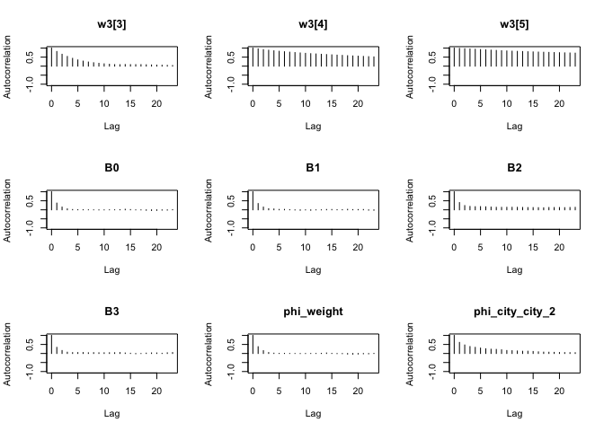
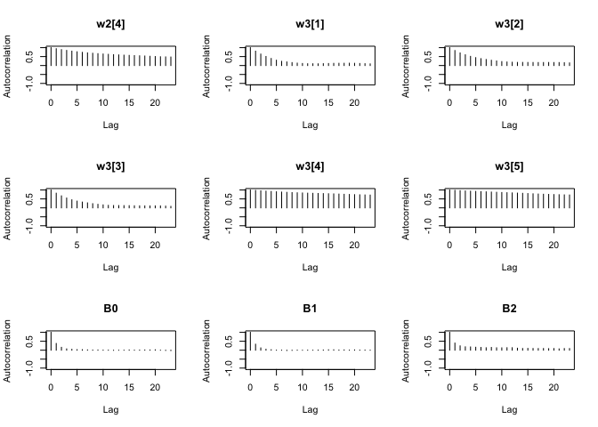
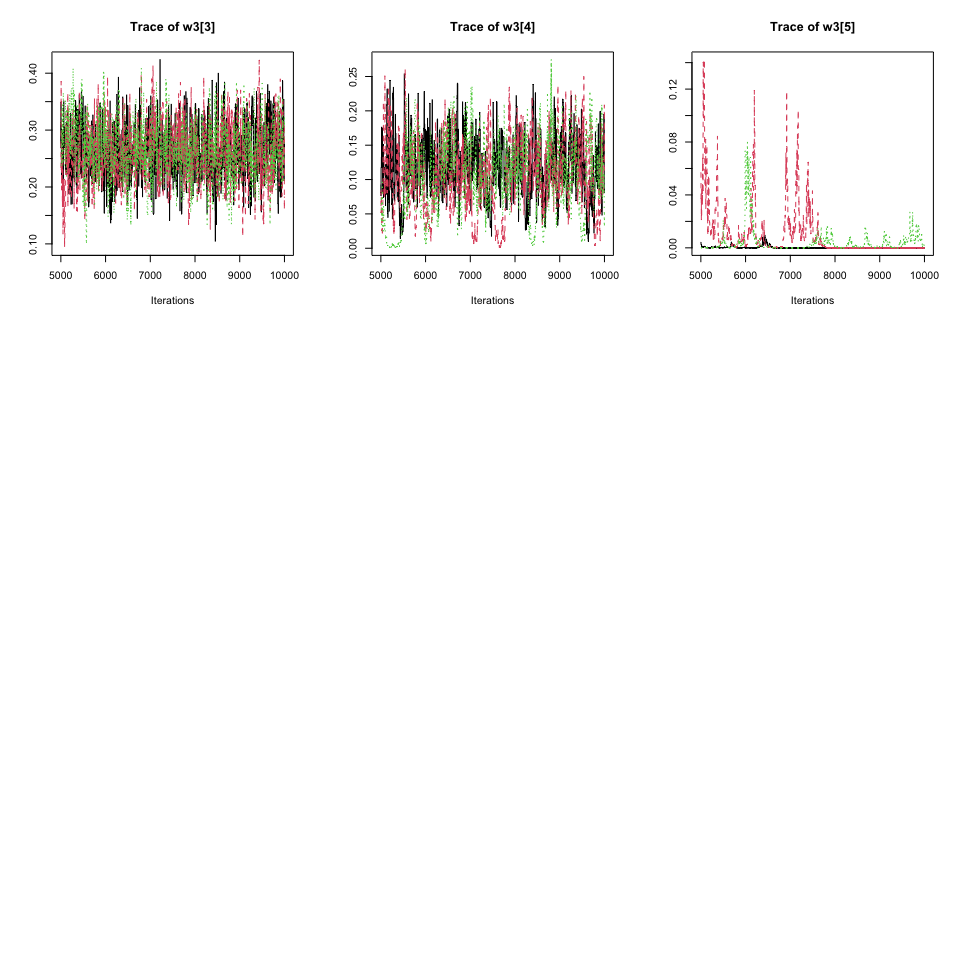

<!-- README.md is generated from README.Rmd. Please edit that file -->

# fgwqsr – Frequentist Grouped Weighted Quantile Sum Regression

Fully frequentist model fitting procedure for the weighted quantile sum
regression formulation. Included in this package is an implementation of
Bayesian Grouped Weighted Quantile Sum Regression (bgwqsr) introduced by
Wheeler, David C et al. that fits mcmc chains in parallel through the
runjags package.

<!-- badges: start -->
<!-- badges: end -->

# Overview

<br> FGWQSR estimates parameters to the following model:

$$y_i \sim \text{Bernoulli}(\pi_i) $$
$$\text{logit}(\pi_i) = c_0+ \sum\limits_{g = 1}^G \gamma_g \bigg( \sum\limits_{k = 1} ^{c_g} w_{g,k} \cdot q_{g,k,i}\bigg) + \sum_{r = 1}^R \phi_rz_{r,i} $$
where

- $y_i$ - outcome variable (coded 0 1)

- $c_0$ - offset variable (intercept)

- $G$ - total number of chemical mixture groups

- $\gamma_g$ - group index effect corresponding to mixture group $g$

- $c_g$ - total number of chemicals in group $g$

- $w_{g,k}$ - weight for chemical $k$ in group $g$

- $q_{g,k,i}$ - quantized chemical exposure $k$ in group $g$ for
  individual $i$

- $R$ - total number of adjusting covariates

- $\phi_r$ - effect of $r^{\text{th}}$ adjusting covariate

- $z_{r,i}$ - measure of adjusting covariate $r$ for individual $i$

subject to the constraints
$$\sum_{k = 1}^{c_g} w_{g,k} =1, \ w_{g,k} \in (0,1)$$

<br>

# Installation

You can install the development version of fgwqsr from
[GitHub](https://github.com/) with:

``` r
# install.packages("devtools")
devtools::install_github("Daniel-Rud/fgwqsr")
```

``` r
library(fgwqsr)
```

In order to use fgwqsr, let us first generate some data

# Data Generation

<br> To begin, let us generate some data to use. We will have 14
underlying chemical exposure variables, with mixture groups of sizes
(5,4,5) and weight distribution

- $\mathbf{w}_1 = (1/3,1/3,1/3,0,0)$

- $\mathbf{w}_2 = (1/2,1/2, 0, 0)$

- $\mathbf{w}_3 = (1/3,1/3,1/3,0,0)$.

We will use a fixed correlation structure such that the correlation of
chemicals within a group is .7 and the cross correlations between 2
chemicals in different groups is .5. <br> We first define ESS and CCS.
ESS is a list that contains the the sample size and the true underlying
weight distribution of the chemicals in each group. CCS is a two element
vector where the first index defines the within group correlation and
the second index controls the between group correlation. The sample size
for our dataset is fixed to $n = 10,000$ and we set the distribution of
the true underlying weights as follows:

<br> We set the group index effects for the three groups as follows (in
OR scale): $\exp(\gamma_1) = .5$, $\exp(\gamma_2) = 1$,
$\exp(\gamma_3) = 1.5$

``` r
n = 10000

gamma = log(c(.5,1,1.5)) # group index sizes in log odds scale

ess = list(n = n, 
           weights = list(w1 = c(1/3,1/3,1/3,0,0), 
                          w2 = c(1/2,1/2, 0, 0), 
                          w3 = c(1/3,1/3,1/3,0,0)
                          )
           )

ccs = c(.5,.1)
```

<br>

We create a function to create the desired correlation matrix.

``` r
# function to create correlation matrix 
create_corr_mat = function(ESS, CCS)
{
  num_pollutants = length(unlist(ESS$weights))
  num_groups = length(ESS$weights)
  
  current_index = 1
  
  corr_mat = diag(num_pollutants)
  
  # populate within group correlation blocks 
  for(i in 1:num_groups) # for each of the pollutant groups
  {
    corr_mat[current_index:(current_index + length(ESS$weights[[i]])-1), 
             current_index:(current_index + length(ESS$weights[[i]])-1) ] = CCS[1]
    current_index = current_index + length(ESS$weights[[i]])
  }
  
  # populate between group pollutant correlations 
  # set diagonal to 1 
  for(i in 1:num_pollutants)
  {
    corr_mat[i, which(corr_mat[i,] == 0)] = CCS[2]
    corr_mat[i,i] = 1
  }
  
  return(corr_mat)
}
```

<br>

Now we create a correlation matrix

``` r
corr = create_corr_mat(ESS = ess, CCS = ccs)

corr %>% data.frame # for viewing  
#>     X1  X2  X3  X4  X5  X6  X7  X8  X9 X10 X11 X12 X13 X14
#> 1  1.0 0.5 0.5 0.5 0.5 0.1 0.1 0.1 0.1 0.1 0.1 0.1 0.1 0.1
#> 2  0.5 1.0 0.5 0.5 0.5 0.1 0.1 0.1 0.1 0.1 0.1 0.1 0.1 0.1
#> 3  0.5 0.5 1.0 0.5 0.5 0.1 0.1 0.1 0.1 0.1 0.1 0.1 0.1 0.1
#> 4  0.5 0.5 0.5 1.0 0.5 0.1 0.1 0.1 0.1 0.1 0.1 0.1 0.1 0.1
#> 5  0.5 0.5 0.5 0.5 1.0 0.1 0.1 0.1 0.1 0.1 0.1 0.1 0.1 0.1
#> 6  0.1 0.1 0.1 0.1 0.1 1.0 0.5 0.5 0.5 0.1 0.1 0.1 0.1 0.1
#> 7  0.1 0.1 0.1 0.1 0.1 0.5 1.0 0.5 0.5 0.1 0.1 0.1 0.1 0.1
#> 8  0.1 0.1 0.1 0.1 0.1 0.5 0.5 1.0 0.5 0.1 0.1 0.1 0.1 0.1
#> 9  0.1 0.1 0.1 0.1 0.1 0.5 0.5 0.5 1.0 0.1 0.1 0.1 0.1 0.1
#> 10 0.1 0.1 0.1 0.1 0.1 0.1 0.1 0.1 0.1 1.0 0.5 0.5 0.5 0.5
#> 11 0.1 0.1 0.1 0.1 0.1 0.1 0.1 0.1 0.1 0.5 1.0 0.5 0.5 0.5
#> 12 0.1 0.1 0.1 0.1 0.1 0.1 0.1 0.1 0.1 0.5 0.5 1.0 0.5 0.5
#> 13 0.1 0.1 0.1 0.1 0.1 0.1 0.1 0.1 0.1 0.5 0.5 0.5 1.0 0.5
#> 14 0.1 0.1 0.1 0.1 0.1 0.1 0.1 0.1 0.1 0.5 0.5 0.5 0.5 1.0
```

<br>

We generate our exposure data based on the derived correlation
structure. We will use 5 quantiles, as that is the default for FGWQSR.

``` r
set.seed(1) # for reproducibility
chem_data = mvtnorm::rmvnorm(n, mean = rep(0, 14), sigma = corr)
```

<br>

Next, we quantize the exposure variables in order to make comparisons
between the true underlying oracle model and FGWQSR estimates. Note that
we will subtract 1 from our quantized variables, so that the first
quintile corresponds to the measure of 0. By doing this, we can ensure
that we have an interpretable model intercept.

``` r
chem_data = apply(chem_data, MARGIN = 2, statar::xtile, n = 5) - 1

head(chem_data %>% data.frame)
#>   X1 X2 X3 X4 X5 X6 X7 X8 X9 X10 X11 X12 X13 X14
#> 1  1  2  1  4  3  1  3  3  3   1   4   2   1   0
#> 2  4  3  3  4  4  4  4  4  3   0   2   1   1   0
#> 3  2  3  4  2  3  1  0  1  1   2   4   3   2   2
#> 4  3  3  1  1  3  4  3  4  3   2   3   1   4   4
#> 5  2  1  3  2  4  2  3  2  1   3   1   4   3   4
#> 6  2  0  2  0  0  2  1  2  2   1   1   1   3   0
```

<br>

Finally, we create the logistic outcome variable

``` r

intercept = 0

# create logit(pi) outcome 
logit_pi =  gamma[1] * (chem_data[, 1:5] %*% ess$weights$w1) + 
  gamma[2] * (chem_data[, 6:9] %*% ess$weights$w2) + 
  gamma[3] * (chem_data[, 10:14] %*% ess$weights$w3) + intercept

# transform to pi 
pi = stats::plogis(logit_pi)

# transform to bernoulli outcome 
y = sapply(pi, FUN = function(p) rbinom(1,1,p))

# create dataset 
data = data.frame(y = y, chem_data)

# view dataset
head(data)
#>   y X1 X2 X3 X4 X5 X6 X7 X8 X9 X10 X11 X12 X13 X14
#> 1 0  1  2  1  4  3  1  3  3  3   1   4   2   1   0
#> 2 0  4  3  3  4  4  4  4  4  3   0   2   1   1   0
#> 3 0  2  3  4  2  3  1  0  1  1   2   4   3   2   2
#> 4 0  3  3  1  1  3  4  3  4  3   2   3   1   4   4
#> 5 0  2  1  3  2  4  2  3  2  1   3   1   4   3   4
#> 6 1  2  0  2  0  0  2  1  2  2   1   1   1   3   0
```

<br> Now, we are ready to fit a FGWQSR model

<br>

# Fitting using FGWQSR

<br> From the FGWQSR package, the main function we will be using to fit
models if the fgwqsr() function. The model formula that we specify will
be different than traditional formulas in lm and glm, as we will need to
denote our mixture groups. Three special characters are used in fgwqsr
formulas: <br>

- `|` denotes the boundary of a mixture group, used to seperate
  chemicals within a mixture group.

- `/` - denotes the end of the mixture group specification, adjusting
  covariates can be added to the formula after this character. If no
  adjusting covariates, do not need to specify.

- `i.` - precedes categorical variables to denote a categorical
  variable. For example, if we have a categorical variable cat_var, we
  would denote this in the model formula by i.cat_var. This is similar
  to the stata syntax to declare categorical variables.

<br> The fgwqsr() function has other options too: <br>

- `data` - should be a data frame object containing variable columnames
  referenced in model formula (cat vars do not need to be named with i.
  in columnames)

- `quantiles` - number of quantiles to quantize the exposure variables
  in the mixture portion of the model

- `n_mvn_sims` - defines resolution for simulated null distribution for
  group index and single chemical LRTs. Default is 10,000.

- `zero_threshold_cutoff` - defines a .

- `verbose` - Displays messages and progress bar while fitting FGWQSR
  model. Default is TRUE.

- `cores` - number of cores to parallelize on for fitting nested models
  and simulated null LRT distributions. Default is number of available
  cores on user device.

- `optim_control_list` - option to supply control options to optim.

<br>

First, we will focus on fitting models with only chemical mixture
variables. To do this, we will supply the model formula as follows:

``` r

mod_formula = y ~ X1 + X2 + X3 + X4 + X5 | X6 + X7 + X8 + X9 | X10 + X11 + X12 + X13 + X14
```

<br>

Notice that we did not use the “$/$” character since we did not include
adjusting covariates. Now, we can fit the model using the function
fgwqsr().

``` r
fgwqsr_fit = fgwqsr(formula = mod_formula,
                    data = data,
                    quantiles = 5,
                    n_mvn_sims = 100,
                    verbose = T)
#> 
#> Fitting nested models for Weight Inference:
#> 
#> Now Performing Inference...
```

<br>

We can see the model summary using the call summary()

``` r

summary(fgwqsr_fit)
#> 
#> Call: 
#> FGWQSR with formula 'y ~ X1 + X2 + X3 + X4 + X5 | X6 + X7 + X8 + X9 | X10 + X11 + X12 + X13 + X14' on n = 10000 observations.
#> 
#> 100 samples used for simulated LRT distirbution.
#> 
#> Log Likelihood: -5960.159 | AIC: 11950.32 | BIC: 12058.47
#> 
#> Estimates and Inference for Group Index Effects
#>                  Estimate        LRT P-value    
#> Mixture Index 1 -0.702387 1168.18784  <1e-06 ***
#> Mixture Index 2  0.024676    1.49567    0.57    
#> Mixture Index 3  0.411345  408.88836  <1e-06 ***
#> 
#> Estimates and Inference for Weights
#>    Weight Estimate        LRT P-value    
#> X1        0.305501 128.107913  <1e-06 ***
#> X2        0.336426 156.350666  <1e-06 ***
#> X3        0.322359 142.164908  <1e-06 ***
#> X4        0.023634   0.750190    0.21    
#> X5        0.012080   0.202268    0.35    
#> -------------------------------------------------
#>    Weight Estimate      LRT P-value  
#> X6        0.248205 0.102211    0.42  
#> X7        0.207174 0.071973    0.29  
#> X8        0.111892 0.021212    0.47  
#> X9        0.432729 0.309532    0.26  
#> -------------------------------------------------
#>     Weight Estimate       LRT P-value    
#> X10        0.245935 26.931807  <1e-06 ***
#> X11        0.310206 43.508110  <1e-06 ***
#> X12        0.376066 62.982156  <1e-06 ***
#> X13        0.001262  0.000717    0.45    
#> X14        0.066531  2.051216    0.09   .
#> -------------------------------------------------
#> 
#> Estimates and Inference for Intercept and Adjusting Covariates
#>            Estimate       SE         Z P(Z > |z|)                95% CI  
#> intercept -0.012925 0.064598 -0.200085   0.841414 (-0.139536, 0.113685)  
#> 
#> Significance Codes: <0.001 '***' <0.01 '**' <0.05 '*' <0.10 '.' 
#> 
#> Total runtime for FGWQSR:  1.21 minutes on 10 cores.
```

<br> We can compare the true underlying group indices and chemical
weights with their estimates, along with if the correct inference is
made. Note that dashes are inserted for the true weights of group 2,
since the true underlying group index is null (thus, the weights are
unidentifiable).

``` r
group_index_frame = data.frame("True Group Index" = exp(gamma),
                          "Estimated Group Index" = exp(fgwqsr_fit$inference_frames$group_index_frame[,1]) %>% round(3),
                          "Signficiant?" = ifelse(fgwqsr_fit$inference_frames$group_index_frame[,3] < .05, "Yes", "No"), check.names = F)

rownames(group_index_frame) = rownames(fgwqsr_fit$inference_frames$group_index_frame)

true_weights = ess$weights %>% unlist %>% round(3)
true_weights[6:9] = "-"


weight_frame = data.frame("True Weight" = true_weights,
                          "Estimated Weight" = fgwqsr_fit$inference_frames$weight_frame[,1] %>% round(3),
                          "Signficiant?" = ifelse(fgwqsr_fit$inference_frames$weight_frame[,3] < .05, "Yes", "No"), check.names = F)

group_index_frame; weight_frame
#>                 True Group Index Estimated Group Index Signficiant?
#> Mixture Index 1              0.5                 0.495          Yes
#> Mixture Index 2              1.0                 1.025           No
#> Mixture Index 3              1.5                 1.509          Yes
#>     True Weight Estimated Weight Signficiant?
#> w11       0.333            0.306          Yes
#> w12       0.333            0.336          Yes
#> w13       0.333            0.322          Yes
#> w14           0            0.024           No
#> w15           0            0.012           No
#> w21           -            0.248           No
#> w22           -            0.207           No
#> w23           -            0.112           No
#> w24           -            0.433           No
#> w31       0.333            0.246          Yes
#> w32       0.333            0.310          Yes
#> w33       0.333            0.376          Yes
#> w34           0            0.001           No
#> w35           0            0.067           No
```

<br>

# Fitting with Adjusting Continuous and Categorical Covariates

As mentioned earlier, the “$/$” character in the model formula sent to
fgwqsr() indicates that adjusting covariates follow this character.
Continuous characters can be referenced with their columnname from the
dataset, while categorical variables need to be referenced using the
prefix “i.”. We will illustrate this through an example where we create
a continuous $weight$ variable and a categorical $city$ variable. We
will give an effect (in log odds scale) of .5 to weight, .2 to the
comparison between city 2 and reference city 1, and -1 to the comparison
between city 3 and city 1.

<br>

``` r
set.seed(1)
# create adjusting covariates
weight = rnorm(n = n, mean = 68, sd = 2.5)
city = sample(c("city_1", "city_2", "city_3"), size = n, replace = T)

# need to adjust intercept for case control ratio
intercept = -3.3

# create logit(pi) outcome WITH adjusting covariates
logit_pi =  gamma[1] * (chem_data[, 1:5] %*% ess$weights$w1) +
  gamma[2] * (chem_data[, 6:9] %*% ess$weights$w2) +
  gamma[3] * (chem_data[, 10:14] %*% ess$weights$w3) +
  .05 *weight +
  .2*ifelse(city == "city_2", 1, 0) + -1*ifelse(city == "city_3", 1, 0) +
  intercept

# transform to pi

pi = stats::plogis(logit_pi)

# transform to bernoulli outcome
y = sapply(pi, FUN = function(p) rbinom(1,1,p))

# create dataset

data = data.frame(y = y, chem_data, weight = weight, city = city)

head(data)
#>   y X1 X2 X3 X4 X5 X6 X7 X8 X9 X10 X11 X12 X13 X14   weight   city
#> 1 1  1  2  1  4  3  1  3  3  3   1   4   2   1   0 66.43387 city_3
#> 2 0  4  3  3  4  4  4  4  4  3   0   2   1   1   0 68.45911 city_3
#> 3 0  2  3  4  2  3  1  0  1  1   2   4   3   2   2 65.91093 city_3
#> 4 0  3  3  1  1  3  4  3  4  3   2   3   1   4   4 71.98820 city_3
#> 5 1  2  1  3  2  4  2  3  2  1   3   1   4   3   4 68.82377 city_1
#> 6 0  2  0  2  0  0  2  1  2  2   1   1   1   3   0 65.94883 city_3
```

<br> Now, we specify the formula to include the continuous and
categorical variables and call fgwqsr().

``` r

mod_formula_adj = y ~ X1 + X2 + X3 + X4 + X5 | X6 + X7 + X8 + X9 | X10 + X11 + X12 + X13 + X14 / weight + i.city

fgwqsr_fit_adj = fgwqsr(formula = mod_formula_adj,
                    data = data,
                    quantiles = 5,
                    n_mvn_sims = 100,
                    verbose = T)
#> 
#> Fitting nested models for Weight Inference:
#> 
#> Now Performing Inference...
```

<br> Again, we use the function summary() to view the results of the
fgwqsr() call.

``` r

summary(fgwqsr_fit_adj)
#> 
#> Call: 
#> FGWQSR with formula 'y ~ X1 + X2 + X3 + X4 + X5 | X6 + X7 + X8 + X9 | X10 + X11 + X12 + X13 + X14/weight + i.city' on n = 10000 observations.
#> 
#> 100 samples used for simulated LRT distirbution.
#> 
#> Log Likelihood: -5556.169 | AIC: 11148.34 | BIC: 11278.12
#> 
#> Estimates and Inference for Group Index Effects
#>                  Estimate       LRT P-value    
#> Mixture Index 1 -0.721974 1153.2447  <1e-06 ***
#> Mixture Index 2  0.070848   13.1311    0.01  **
#> Mixture Index 3  0.403725  375.4276  <1e-06 ***
#> 
#> Estimates and Inference for Weights
#>    Weight Estimate        LRT P-value    
#> X1        0.367200 178.322269  <1e-06 ***
#> X2        0.287866 110.033798  <1e-06 ***
#> X3        0.337621 150.472596  <1e-06 ***
#> X4        0.003173   0.013089    0.54    
#> X5        0.004141   0.026154    0.43    
#> -------------------------------------------------
#>    Weight Estimate      LRT P-value  
#> X6        0.027973 0.009814    0.53  
#> X7        0.652795 5.397737    0.02 *
#> X8        0.147947 0.280936    0.33  
#> X9        0.171285 0.367393    0.24  
#> -------------------------------------------------
#>     Weight Estimate     LRT P-value    
#> X10        0.318641 42.0794  <1e-06 ***
#> X11        0.330624 45.7642  <1e-06 ***
#> X12        0.350735 50.9094  <1e-06 ***
#> X13        0.000000  0.0000    0.74    
#> X14        0.000000  0.0000    0.78    
#> -------------------------------------------------
#> 
#> Estimates and Inference for Intercept and Adjusting Covariates
#>              Estimate       SE          Z P(Z > |z|)                 95% CI    
#> intercept   -2.661611 0.624433  -4.262446      2e-05 (-3.885477, -1.437746) ***
#> weight       0.039620 0.009127   4.340902    1.4e-05   (0.021731, 0.057509) ***
#> city_city_2  0.216813 0.054042   4.011911      6e-05   (0.110892, 0.322733) ***
#> city_city_3 -1.035485 0.059087 -17.524742     <1e-06 (-1.151293, -0.919676) ***
#> 
#> Significance Codes: <0.001 '***' <0.01 '**' <0.05 '*' <0.10 '.' 
#> 
#> Total runtime for FGWQSR:  1.13 minutes on 10 cores.
```

<br>

Finally, we can compare the true parameter value with our estimates from
FGWQSR.

``` r

group_index_frame = data.frame("True Group Index" = exp(gamma),
                          "Estimated Group Index" = exp(fgwqsr_fit_adj$inference_frames$group_index_frame$Estimate) %>% round(3),
                          "Signficiant?" = ifelse(fgwqsr_fit_adj$inference_frames$group_index_frame$`P-value` < .05, "Yes", "No"), check.names = F)

rownames(group_index_frame) = rownames(fgwqsr_fit_adj$inference_frames$group_index_frame)

true_weights = ess$weights %>% unlist %>% round(3)
true_weights[6:9] = "-"


weight_frame = data.frame("True Weight" = true_weights,
                          "Estimated Weight" = fgwqsr_fit_adj$inference_frames$weight_frame$`Weight Estimate` %>% round(3),
                          "Signficiant?" = ifelse(fgwqsr_fit_adj$inference_frames$weight_frame$`P-value` < .05, "Yes", "No"), check.names = F)


adj_cov_frame = data.frame("True Covariate Effect" = c(-3.3, .5,.2,-1),
                           "Estimated Covariate Effect" = fgwqsr_fit_adj$inference_frames$adj_param_frame$Estimate,
                           "Significant?" = ifelse(fgwqsr_fit_adj$inference_frames$adj_param_frame$`P(Z > |z|)` < .05, "Yes", "No"), check.names = F)

rownames(adj_cov_frame) = rownames(fgwqsr_fit_adj$inference_frames$adj_param_frame)

group_index_frame; weight_frame; adj_cov_frame
#>                 True Group Index Estimated Group Index Signficiant?
#> Mixture Index 1              0.5                 0.486          Yes
#> Mixture Index 2              1.0                 1.073          Yes
#> Mixture Index 3              1.5                 1.497          Yes
#>     True Weight Estimated Weight Signficiant?
#> w11       0.333            0.367          Yes
#> w12       0.333            0.288          Yes
#> w13       0.333            0.338          Yes
#> w14           0            0.003           No
#> w15           0            0.004           No
#> w21           -            0.028           No
#> w22           -            0.653          Yes
#> w23           -            0.148           No
#> w24           -            0.171           No
#> w31       0.333            0.319          Yes
#> w32       0.333            0.331          Yes
#> w33       0.333            0.351          Yes
#> w34           0            0.000           No
#> w35           0            0.000           No
#>             True Covariate Effect Estimated Covariate Effect Significant?
#> intercept                    -3.3                 -2.6616115          Yes
#> weight                        0.5                  0.0396203          Yes
#> city_city_2                   0.2                  0.2168125          Yes
#> city_city_3                  -1.0                 -1.0354846          Yes
```

# Fitting Models with BGWQSR

We also provide in this package functions to run BGWQSR models using the
runjags package. The bgwqsr() function takes a model formulation similar
to that in fgwqsr(), also utilizing the special characters “$|$”, “$/$”,
and “i.”. Fitting the BGWQSR model using runjags allows us to leverage
the “parallel” method in runjags that allows us to fit independent mcmc
chains on multiple cores, speeding up fitting time.

``` r

bgwqsr_fit = bgwqsr(formula = mod_formula_adj,
                    data = data,
                    quantiles = 5,
                    n.iter = 1000,
                    n.burnin = 40,
                    n.thin = 1, n.chains = 3,
                    n.adapt = 10,
                    method = "parallel")
#> Calling 3 simulations using the parallel method...
#> Following the progress of chain 1 (the program will wait for all chains
#> to finish before continuing):
#> Welcome to JAGS 4.3.2 (official binary) on Thu Jul 13 16:39:27 2023
#> JAGS is free software and comes with ABSOLUTELY NO WARRANTY
#> Loading module: basemod: ok
#> Loading module: bugs: ok
#> . Loading module: glm: ok
#> . . Reading data file data.txt
#> . Compiling model graph
#>    Resolving undeclared variables
#>    Allocating nodes
#> Graph information:
#>    Observed stochastic nodes: 10000
#>    Unobserved stochastic nodes: 17
#>    Total graph size: 220906
#> . Reading parameter file inits1.txt
#> . Initializing model
#> . Adapting 10
#> Adaptation incomplete
#> . Updating 40
#> . . . . . . . . . . . . . . . . . . . . . . Updating 1000
#> -------------------------------------------------| 1000
#> ************************************************** 100%
#> . . . . Updating 0
#> . Deleting model
#> All chains have finished
#> Simulation complete.  Reading coda files...
#> Coda files loaded successfully
#> Calculating summary statistics...
#> Calculating the Gelman-Rubin statistic for 21 variables....
#> Finished running the simulation
#> Calculating summary statistics...
#> Calculating the Gelman-Rubin statistic for 21 variables....
```

<br>

To retrieve the summary measures from the MCMC sampling, we can extract
the summaries object from the bgwqsr model.

``` r
bgwqsr_fit$model$summaries
#>                      Lower95      Median    Upper95        Mean          SD
#> B0              -3.66123e+00 -2.39290500 -1.1861800 -2.39739069 0.634468040
#> B1              -7.72786e-01 -0.72645600 -0.6800990 -0.72660810 0.023277413
#> B2               2.37607e-02  0.06537670  0.1003650  0.06536587 0.019642886
#> B3               3.63499e-01  0.40572200  0.4474280  0.40561747 0.021839322
#> phi_weight       1.89506e-02  0.03606285  0.0550746  0.03618030 0.009279348
#> phi_city_city_2  7.34225e-02  0.18715100  0.3012290  0.18582929 0.058262250
#> phi_city_city_3 -1.15691e+00 -1.04109500 -0.9208620 -1.04254740 0.060202532
#> w1[1]            3.04382e-01  0.35634400  0.4028740  0.35519930 0.025022040
#> w1[2]            2.24530e-01  0.27524900  0.3275130  0.27527586 0.027174372
#> w1[3]            2.73493e-01  0.32465400  0.3750100  0.32459352 0.025632267
#> w1[4]            1.42449e-03  0.01984735  0.0530367  0.02323464 0.016088007
#> w1[5]            1.12253e-03  0.01720880  0.0528875  0.02169668 0.016733905
#> w2[1]            3.67407e-05  0.06011960  0.4136620  0.11226925 0.141633116
#> w2[2]            2.26175e-01  0.64955500  0.9632770  0.62196864 0.215645672
#> w2[3]            3.07270e-04  0.06649090  0.4829810  0.13660496 0.159574279
#> w2[4]            2.15090e-03  0.07107550  0.4630890  0.12915714 0.145145484
#> w3[1]            2.20125e-01  0.31116300  0.4052840  0.31066550 0.047176347
#> w3[2]            2.19036e-01  0.31893700  0.4000210  0.31852408 0.045626503
#> w3[3]            2.54194e-01  0.34016300  0.4388580  0.34185267 0.048814994
#> w3[4]            3.60342e-05  0.01048015  0.0532486  0.01632025 0.018750977
#> w3[5]            4.91520e-04  0.00627269  0.0457712  0.01263749 0.015396609
#>                 Mode        MCerr MC%ofSD SSeff        AC.10      psrf
#> B0                NA 0.0194944981     3.1  1059  0.073421818 1.0007923
#> B1                NA 0.0006149110     2.6  1433  0.009592373 1.0073064
#> B2                NA 0.0005063518     2.6  1505  0.032182820 1.0016705
#> B3                NA 0.0006025792     2.8  1314 -0.003453728 1.0031507
#> phi_weight        NA 0.0002872937     3.1  1043  0.076869836 1.0007030
#> phi_city_city_2   NA 0.0021934538     3.8   706  0.077124829 1.0014526
#> phi_city_city_3   NA 0.0017505307     2.9  1183  0.016120407 0.9997214
#> w1[1]             NA 0.0014826534     5.9   285  0.139924144 1.0098148
#> w1[2]             NA 0.0016370561     6.0   276  0.254728423 1.1046637
#> w1[3]             NA 0.0013094884     5.1   383  0.143430848 1.0142796
#> w1[4]             NA 0.0028510016    17.7    32  0.824486353 1.3104306
#> w1[5]             NA 0.0035531520    21.2    22  0.859320780 1.4968418
#> w2[1]             NA 0.0309624037    21.9    21  0.826824935 1.7068957
#> w2[2]             NA 0.0370243826    17.2    34  0.806995509 1.0722833
#> w2[3]             NA 0.0260563107    16.3    38  0.805258053 1.1934215
#> w2[4]             NA 0.0234176703    16.1    38  0.755691107 1.4542547
#> w3[1]             NA 0.0034160290     7.2   191  0.286905730 1.0207991
#> w3[2]             NA 0.0030011662     6.6   231  0.246041668 1.0043634
#> w3[3]             NA 0.0032776357     6.7   222  0.246060417 1.0017560
#> w3[4]             NA 0.0028892295    15.4    42  0.818470479 1.4263795
#> w3[5]             NA 0.0033045455    21.5    22  0.862353513 1.1111806
```

We can analyze the mixing of the markov chains and corresponding
autocorrelation plots using functions from the coda package. We will
output only the first few plots.

``` r
coda::traceplot(bgwqsr_fit$model$mcmc) # traceplot
```


``` r
coda::autocorr.plot(bgwqsr_fit$model$mcmc, auto.layout = F, ask = F) # autocorrelation plot
```


``` r
coda::densplot(bgwqsr_fit$model$mcmc) # posterior density plots
```



``` r
plot(bgwqsr_fit$model$mcmc, auto.layout = F) # combines traceplot() and densplot()
```



Finally, we can look at plots for the posterior credible intervals for
group indices, single chemical weights, and corresponding posterior
means. To do this, we can use the functions plotWeights(), plotBetas(),
and plotResult(). plotResults() combines both plots generates by
plotWeights and plotBetas into a side by side figure. Below are code
examples for each of the three function calls.

``` r
plot_betas(bgwqsr_fit)
```


``` r
plot_weights(bgwqsr_fit)
```


``` r
plot_results(bgwqsr_fit)
```


